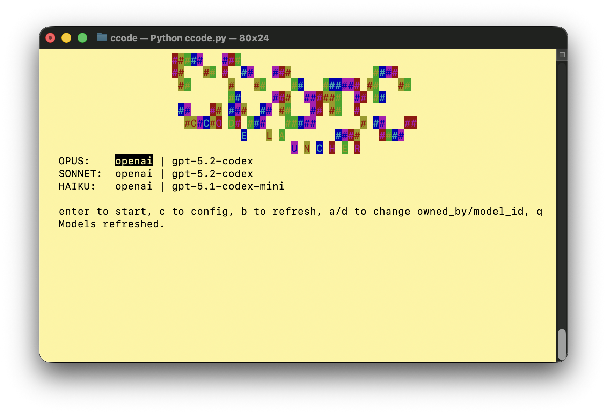

# CCode Launcher (Curses UI)

这是一个基于 curses 的 Claude Code 启动器，提供键盘全操作的终端界面，用于配置 Base URL、API Key、模型选择和常用开关，并直接启动 `claude` 命令。

工具的目的是方便启动claude code时快速选择想要使用的模型。模型网关可以使用litellm proxy 或者 CLI Proxy API


## 功能特点

- 终端 curses UI，键盘全操作
- 主界面选择 OPUS / SONNET / HAIKU 的 owned_by 与 model_id
- 配置界面编辑 Base URL / API Key 与常用开关
- 自动保存配置到 `~/.ccode/config.json`
- 直接启动 `claude` 并传递额外参数
- 动画 Logo（颜色渐变 / 流光 / 轻微波浪）

## 依赖

- Python 3（标准库，无第三方依赖）

## 运行方式

```bash
python ccode.py
```

传递额外参数给 `claude`：

```bash
python ccode.py --chrome
```

## 快捷键（主界面）

- `↑ / ↓`：切换 OPUS / SONNET / HAIKU 行
- `← / →`：切换 owned_by / model_id 字段
- `a / d`：循环切换当前字段的可选项
- `b`：刷新模型列表
- `c`：进入配置界面
- `Enter`：校验并启动 `claude`
- `q`：退出

> 提示：首次使用需要先在配置界面设置 Base URL 与 API Key，然后返回主界面按 `b` 获取模型列表。

## 快捷键（配置界面）

- `↑ / ↓`：移动字段焦点
- `Enter / Space`：切换开关项
- 文本输入：编辑 BASE_URL / API_KEY
- `ESC`：自动保存并返回主界面

## 配置文件

配置自动保存在：

```
~/.ccode/config.json
```

示例结构：

```json
{
  "base_url": "http://127.0.0.1:8317",
  "api_key": "",
  "models": {
    "opus": {"owned_by": null, "id": null},
    "sonnet": {"owned_by": null, "id": null},
    "haiku": {"owned_by": null, "id": null}
  },
  "toggles": {
    "CLAUDE_CODE_ENABLE_TELEMETRY": 0,
    "DISABLE_COST_WARNINGS": 1,
    "CLAUDE_CODE_DISABLE_NONESSENTIAL_TRAFFIC": 1
  }
}
```

## 工作原理

1. 从 `~/.ccode/config.json` 读取配置（首次运行自动生成）。
2. 根据 Base URL + API Key 拉取模型列表。
3. 选择 OPUS / SONNET / HAIKU 的 owned_by / model_id。
4. 启动 `claude`，并注入相关环境变量。

## 许可证

MIT
