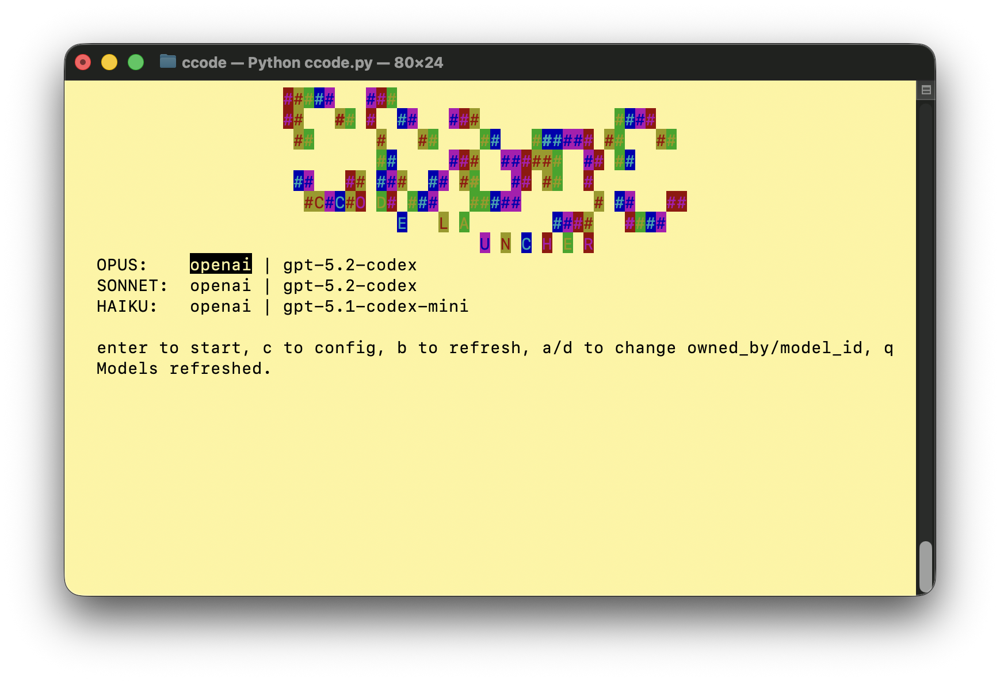
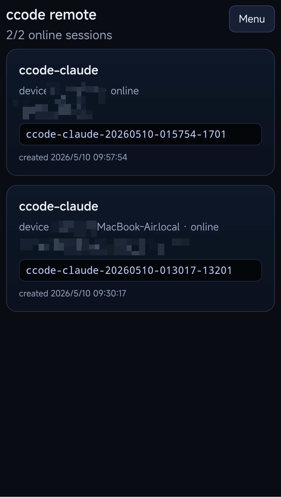
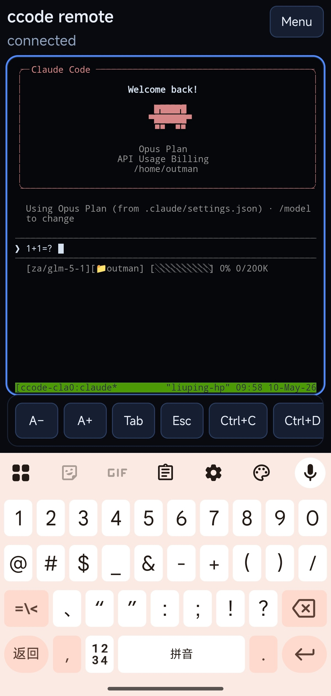

# CCode Launcher (Curses UI)

这是一个基于 curses 的 Claude Code 启动器，提供键盘全操作的终端界面，用于配置 Base URL、API Key、模型选择和常用开关，并直接启动 `claude` 命令。

工具的目的是方便启动 claude code 时快速选择想要使用的模型。模型网关可以使用 litellm proxy 或者 CLI Proxy API。



<p align="center">
  
  
</p>

## 功能特点

- 终端 curses UI，键盘全操作
- 主界面选择 OPUS / SONNET / HAIKU 的 owned_by 与 model_id
- 配置界面编辑 Base URL / API Key 与常用开关
- 自动保存配置到 `~/.ccode/config.json`
- 直接启动 `claude` 并传递额外参数
- Remote/Web 模式：通过 tmux 保留多个 Claude Code 会话，并在浏览器中选择和操作
- 支持本机 local hub，也支持公网中心 `ccode-remote-server` 聚合多台设备
- 动画 Logo（颜色渐变 / 流光 / 轻微波浪）

## 安装

推荐使用 [uv](https://github.com/astral-sh/uv) 安装为全局工具：

```bash
uv tool install ccoding
```

如果需要 Remote/Web 功能，按使用场景安装对应 extra：

```bash
uv tool install 'ccoding[remote-client]'   # 客户端设备：运行 ccode，并连接中心 server
uv tool install 'ccoding[remote-server]'   # 公网中心 server：运行 ccode-remote-server
uv tool install 'ccoding[remote]'          # 同时包含 client/server remote 依赖
```

已经安装过基础版本时，可以用 `--reinstall` 重新安装带 extra 的版本：

```bash
uv tool install --reinstall 'ccoding[remote]'
```

或使用 [pipx](https://pipx.pypa.io)：

```bash
pipx install ccoding
pipx install 'ccoding[remote]'
```

### uv tool extras 区别

`uv tool install 'ccoding[remote-client]'`、`uv tool install 'ccoding[remote-server]'` 和 `uv tool install 'ccoding[remote]'` 安装的都是同一个 Python 包 `ccoding`，因此都会安装基础命令入口。区别只在于额外依赖是否齐全，以及对应 remote 能力是否可用。

| 安装方式 | `ccode` 基础 TUI | `ccode-remote` | `ccode-remote-server` | 安装的额外依赖 | 适合场景 |
|---|---:|---:|---:|---|---|
| `uv tool install ccoding` | 可用 | 命令存在，但 remote 功能依赖不足 | 命令存在，但缺 server 依赖不能运行 | 无 | 只用模型选择 TUI |
| `uv tool install 'ccoding[remote-client]'` | 可用 | 可管理 client connector；local hub 可能缺 FastAPI/uvicorn | 命令存在，但缺 FastAPI/uvicorn 不能运行 | `pexpect`、`websockets` | 客户端设备：启动 Claude session 并连接中心 server |
| `uv tool install 'ccoding[remote-server]'` | 可用 | 命令存在，但 client/local 能力依赖不足 | 可运行 | `fastapi`、`uvicorn[standard]` | 只部署公网中心 server |
| `uv tool install 'ccoding[remote]'` | 可用 | 可用 | 可用 | `pexpect`、`websockets`、`fastapi`、`uvicorn[standard]` | 开发环境或单机全功能 |

推荐选择：

- 只在本机选择模型并启动 Claude：`uv tool install ccoding`
- 这台机器是“客户端设备”，需要用 `ccode` 启动 remote session 并连接中心 server：`uv tool install 'ccoding[remote-client]'`
- 这台机器只负责运行公网中心 server：`uv tool install 'ccoding[remote-server]'`
- 不想区分角色，或开发调试需要本机同时跑 server 和 client：`uv tool install 'ccoding[remote]'`

安装后直接运行：

```bash
ccode
ccode --chrome   # 传递额外参数给 claude
ccode-remote     # 查看 remote hub / client connector 状态
```

## 开发者运行方式

需要 Python >=3.10。基础 TUI 不再强制安装 remote 依赖。Remote/Web 模式需要额外依赖，并需要系统中已安装 `tmux` 和 `claude`；Windows 建议在 WSL 中使用 remote 模式。

使用 Remote/Web 时，推荐在 `~/.tmux.conf` 中配置：

```tmux
set -g history-limit 50000
set -g mouse on
set -g default-terminal "screen-256color"
set-option -ga terminal-overrides ",xterm-256color:Tc"
```

```bash
git clone https://github.com/8DE4732A/ccode
cd ccode
uv sync
uv run ccode
```

按需安装 remote extras：

```bash
uv sync --extra remote-client   # 客户端 connector：pexpect + websockets
uv sync --extra remote-server   # 公网中心 server：FastAPI + uvicorn
uv sync --extra remote          # 同时安装 client/server 依赖
```

## 快捷键（主界面）

- `↑ / ↓`：切换 OPUS / SONNET / HAIKU 行
- `← / →`：切换 owned_by / model_id 字段
- `a / d`：循环切换当前字段的可选项
- `b`：刷新模型列表
- `r`：切换 Remote/Web 模式
- `c`：进入配置界面
- `Enter`：校验并启动本地 `claude`；Remote/Web 模式开启时启动 remote session
- `q`：退出

> 提示：首次使用需要先在配置界面设置 Base URL 与 API Key，然后返回主界面按 `b` 获取模型列表。

## 快捷键（配置界面）

- `↑ / ↓`：移动字段焦点
- `Enter / Space`：切换开关项
- 文本输入：编辑 BASE_URL / API_KEY、remote local/server URL/appId/appKey/device/prefix 等字段
- `g`：在 Remote appId 或 appKey 字段重新生成对应值
- `ESC`：自动保存并返回主界面

## 配置文件

配置自动保存在：

```
~/.ccode/config.json
```

示例结构：

```json
{
  "base_url": "http://127.0.0.1:8317",
  "api_key": "",
  "models": {
    "opus": {"owned_by": null, "id": null},
    "sonnet": {"owned_by": null, "id": null},
    "haiku": {"owned_by": null, "id": null}
  },
  "toggles": {
    "CLAUDE_CODE_ENABLE_TELEMETRY": "0",
    "DISABLE_COST_WARNINGS": "1",
    "CLAUDE_CODE_DISABLE_NONESSENTIAL_TRAFFIC": "1"
  },
  "remote": {
    "enabled": false,
    "mode": "local",
    "session_name": "ccode-claude",
    "reuse_session": true,
    "local": {
      "host": "127.0.0.1",
      "port": 8765,
      "appId": "",
      "appKey": ""
    },
    "server": {
      "url": "",
      "appId": "",
      "appKey": "",
      "device_name": "",
      "device_id": "",
      "auto_connect": true,
      "verify_tls": true
    }
  }
}
```

## Remote/Web 模式

Remote/Web 让 Claude Code 运行在 tmux session 中，浏览器通过 WebSocket attach 到这个 session。它有两种模式：

| 模式 | 浏览器访问 | session 所在位置 | 适合场景 |
|---|---|---|---|
| `local` | 直接访问本机 local hub | 当前这台机器 | 单机使用，或把这一台机器通过 tunnel 暴露出去 |
| `server` | 访问公网中心 `ccode-remote-server` | 各客户端设备本机 | 多设备、NAT 后设备、统一入口管理多个 sessions |

Remote/Web 使用 appId/appKey HMAC 认证。网络请求只携带 `appId`、`timestamp` 和 `sign`，其中 `sign` 由 appKey 计算，appKey 不会被发送。浏览器端只保存 24 小时有效的签名票据，过期后需要重新输入 appKey；客户端 connector 会从本地配置读取 appKey 并在重连时自动重新签名。旧版配置中的 `token` 会在读取时迁移为 `appKey`，并自动生成 `appId`。

### local 模式

local 模式会在本机启动一个共享 FastAPI hub。浏览器直接访问这个 hub，hub 再 attach 到本机 tmux session。

```text
Browser
  │ HTTP / WebSocket
  ▼
Local ccode remote hub
  │ pexpect attach
  ▼
tmux session
  │
  ▼
claude
```

使用步骤：

1. 安装完整 remote 或至少确保 local hub 依赖可用：

   ```bash
   uv tool install 'ccoding[remote]'
   ```

2. 运行 `ccode`，进入配置页：

   - `MODE`：`local`
   - `LOCAL HOST`：默认 `127.0.0.1`
   - `LOCAL PORT`：默认 `8765`
   - `LOCAL APP ID` / `LOCAL APP KEY`：手动输入，或在对应字段按 `g` 生成

3. 回到主界面，按 `r` 开启 Remote/Web，再按 `Enter` 启动 remote session。

4. 浏览器打开终端输出的本地地址，输入 `LOCAL APP ID` / `LOCAL APP KEY`，选择 session 后进入 terminal。

local 模式默认只监听 `127.0.0.1`。终端只输出不带认证信息的本地访问地址。浏览器打开页面后需要手动输入 appId/appKey，前端只保存由 appKey 生成的 24 小时 HMAC 签名票据，不保存 appKey；票据过期或关闭浏览器会话后需要重新输入。所有 session list、session API 和 WebSocket 连接仍然需要签名认证。

每个启用 Remote/Web 的 `ccode` 进程都会创建一个唯一 tmux session，session 名由配置里的 `session_name` 前缀、时间戳和进程号组成，例如 `ccode-claude-20260509-153022-12345`。本机只启动一个共享 remote hub，多个本地 `ccode` 进程会复用同一个 host/port/appId/appKey。浏览器认证后会先显示 session 列表，选择某个 session 后进入 terminal，也可以返回列表重新选择。

如果通过 Cloudflare Tunnel、Nginx、Caddy 等反向代理暴露 local hub，建议额外叠加 Cloudflare Access、Basic Auth 或 OAuth2 proxy。监听 `0.0.0.0` 会把所有 remote sessions 暴露给网络内可达主机，请保护好访问入口和 app credentials。

```bash
cloudflared tunnel --url http://127.0.0.1:8765
```

local hub 日志写入 `~/.ccode/remote_server.log`，记录 hub 启停、session 注册、session API 和 WebSocket 连接状态，不记录 appKey。启动 hub 前如果日志超过 5 MiB 会自动轮转，默认保留 3 个历史文件（`.1`、`.2`、`.3`）。

### server 模式和 `ccode-remote-server`

`ccode-remote-server` 是可部署到公网的中心 registry/router/relay。它不创建本地 PTY，也不会保存 Anthropic API key、模型配置、客户端环境变量或 terminal 内容；每台客户端继续负责自己的 tmux/Claude 会话，并通过出站 WebSocket 连接 server。

整体结构：

```text
                  Browser
                     │
                     │ HTTPS/WSS + admin HMAC
                     ▼
          ┌───────────────────────┐
          │ ccode-remote-server   │
          │ registry/router/relay │
          └───────────┬───────────┘
                      │ attach relay
        ┌─────────────┼─────────────┐
        │             │             │
        ▼             ▼             ▼
 ┌────────────┐ ┌────────────┐ ┌────────────┐
 │ Laptop A   │ │ Server B   │ │ Desktop C  │
 │ connector  │ │ connector  │ │ connector  │
 │ tmux/claude│ │ tmux/claude│ │ tmux/claude│
 └────────────┘ └────────────┘ └────────────┘
```

连接方向：

```text
客户端设备  ──出站 WebSocket──▶  ccode-remote-server  ◀──浏览器访问──  Browser
```

server 不反连客户端，所以客户端可以在 NAT、家庭网络或公司内网后面。只要客户端能主动访问 server，就可以注册设备和暴露自己的 remote sessions。

#### server app credentials

server app credentials 不会自动生成，必须通过环境变量显式设置。认证时网络上传输 appId、timestamp 和 HMAC sign，不传输 appKey：

- `CCODE_REMOTE_SERVER_ADMIN_APP_ID` / `CCODE_REMOTE_SERVER_ADMIN_APP_KEY`：浏览器 Web UI / `/api/*` / browser WebSocket 使用的管理凭据。
- `CCODE_REMOTE_SERVER_CLIENT_APP_ID` / `CCODE_REMOTE_SERVER_CLIENT_APP_KEY`：各设备客户端 connector 注册和心跳使用的客户端凭据。
- `CCODE_REMOTE_SERVER_HOST` / `CCODE_REMOTE_SERVER_PORT`：可选，默认监听 `127.0.0.1:8765`。

启动中心 server：

```bash
CCODE_REMOTE_SERVER_ADMIN_APP_ID="admin-app" \
CCODE_REMOTE_SERVER_ADMIN_APP_KEY="admin-secret" \
CCODE_REMOTE_SERVER_CLIENT_APP_ID="client-app" \
CCODE_REMOTE_SERVER_CLIENT_APP_KEY="client-secret" \
ccode-remote-server --host 127.0.0.1 --port 8765
```

如果使用源码开发环境运行：

```bash
CCODE_REMOTE_SERVER_ADMIN_APP_ID="admin-app" \
CCODE_REMOTE_SERVER_ADMIN_APP_KEY="admin-secret" \
CCODE_REMOTE_SERVER_CLIENT_APP_ID="client-app" \
CCODE_REMOTE_SERVER_CLIENT_APP_KEY="client-secret" \
uv run --extra remote-server ccode-remote-server --host 127.0.0.1 --port 8765
```

浏览器访问 server 页面时输入 admin appId/appKey。前端只保存 24 小时有效的 HMAC 签名票据，不保存 appKey。如果未设置 `CCODE_REMOTE_SERVER_ADMIN_APP_ID` / `CCODE_REMOTE_SERVER_ADMIN_APP_KEY`，管理 API 会返回 401。

#### 客户端设备配置

每台客户端设备需要安装 client extra：

```bash
uv tool install 'ccoding[remote-client]'
```

然后运行 `ccode`，在配置页设置：

- `MODE`：`server`
- `SERVER URL`：中心 server 地址，例如 `http://127.0.0.1:8765`；如果只填 `127.0.0.1:8765`，会自动按 `http://127.0.0.1:8765` 处理
- `CLIENT APP ID` / `CLIENT APP KEY`：与 server 的 `CCODE_REMOTE_SERVER_CLIENT_APP_ID` / `CCODE_REMOTE_SERVER_CLIENT_APP_KEY` 一致
- `DEVICE NAME`：设备显示名，可留空后由配置迁移填充 hostname
- `DEVICE ID`：稳定设备 ID，可留空后自动生成
- `AUTO CONNECT`：是否默认自动连接中心 server

配置完成后，在主界面按 `r` 开启 Remote/Web，再按 `Enter` 启动 remote session。server 模式会注册本地 tmux session，并确保后台 client connector 运行。浏览器打开中心 server 后即可看到所有在线设备和 sessions。

也可以用命令检查和管理客户端 connector：

```bash
ccode-remote client status
ccode-remote client start
ccode-remote client restart
ccode-remote client stop
```

#### attach 数据流

浏览器点击某个设备上的 session 时，server 会创建一次性短生命周期 `attach_id`，通知目标客户端主动建立 attach WebSocket，然后在浏览器和客户端之间转发 terminal JSON 帧。

```text
1. Browser ── WS /ws/devices/{device_id}/sessions/{session_id} ──▶ Server
2. Server  ── attach_request(attach_id, session_id) ─────────────▶ Client connector
3. Client  ── WS /client/attach/{attach_id} ─────────────────────▶ Server
4. Server  ◀──────────── relay input/output/resize ─────────────▶ Browser
5. Client connector ── pexpect ──▶ local tmux session ──▶ claude
```

server 只做 registry/router/relay，不保存 terminal frame data，不保存 Anthropic API key，不保存模型配置。`cwd`、tmux session 名、创建时间等 metadata 会用于 session 列表展示。

#### Cloudflare Tunnel / 反向代理

如果用 Cloudflare Tunnel 暴露中心 server，只需要 tunnel server 这一处入口，多台客户端设备都配置同一个 `SERVER URL` 和 `CLIENT APP ID` / `CLIENT APP KEY`：

```bash
cloudflared tunnel --url http://127.0.0.1:8765
```

生产环境建议只使用 HTTPS/WSS；如果 `SERVER URL` 使用 `http://`，客户端会提示明文连接风险。建议再叠加 Cloudflare Access、Basic Auth 或 OAuth2 proxy。

### remote 管理命令

`ccode-remote` 会根据当前配置的 `remote.mode` 自动管理 local hub 或 client connector；也可以显式指定 `local` / `client`：

```bash
ccode-remote
ccode-remote status
ccode-remote start
ccode-remote restart
ccode-remote stop

ccode-remote local status
ccode-remote local start
ccode-remote local stop

ccode-remote client status
ccode-remote client start
ccode-remote client restart
ccode-remote client stop
```

日志和状态文件：

| 文件 | 用途 |
|---|---|
| `~/.ccode/remote_sessions.json` | 本机 session registry，只记录 tmux session、cwd、args、创建时间和 owner pid |
| `~/.ccode/remote_server.log` | local hub 日志 |
| `~/.ccode/remote_client.log` | server 模式 client connector 日志 |
| `~/.ccode/remote_hub.pid` | local hub 后台进程 pid |
| `~/.ccode/remote_client.pid` | client connector 后台进程 pid |

浏览器和多个本地终端可以同时 attach 到同一个 tmux session，输入会互相影响，这是预期行为。可用 `Ctrl+B` 然后 `D` 从本地终端 detach；remote hub 或 client connector 会独立留在后台运行，tmux session 不会因为浏览器断开而被 kill。

## 工作原理

基础启动流程：

```text
~/.ccode/config.json
        │
        ▼
ccode curses UI ── fetch /v1/models ──▶ LiteLLM proxy / CLI Proxy API
        │
        ▼
选择 OPUS / SONNET / HAIKU model_id
        │
        ▼
build_env() 注入环境变量
        │
        ▼
subprocess.run(["claude", ...])
```

1. 从 `~/.ccode/config.json` 读取配置（首次运行自动生成）。
2. 根据 Base URL + API Key 拉取模型列表。
3. 选择 OPUS / SONNET / HAIKU 的 owned_by / model_id。
4. 启动 `claude`，并注入相关环境变量。

## 许可证

MIT
